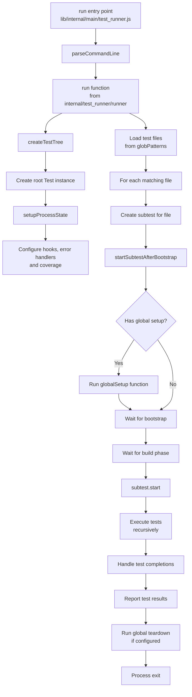
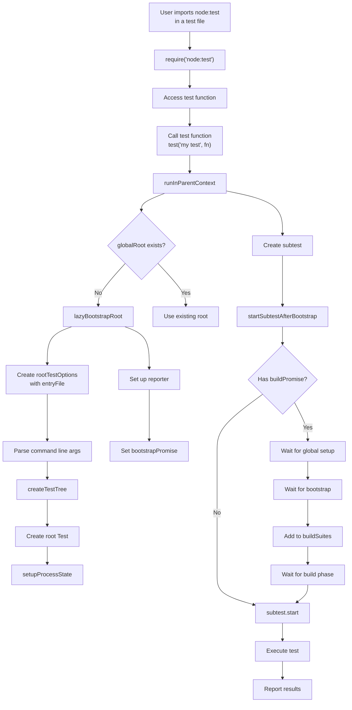
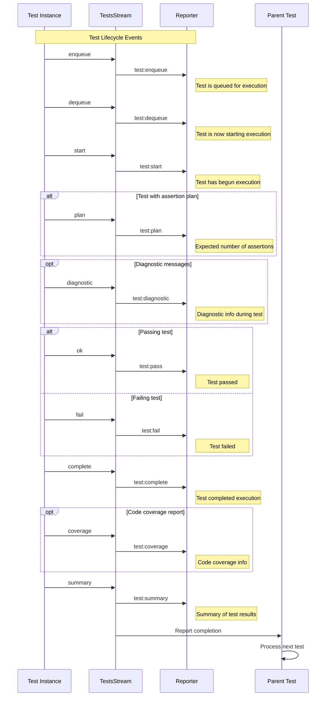
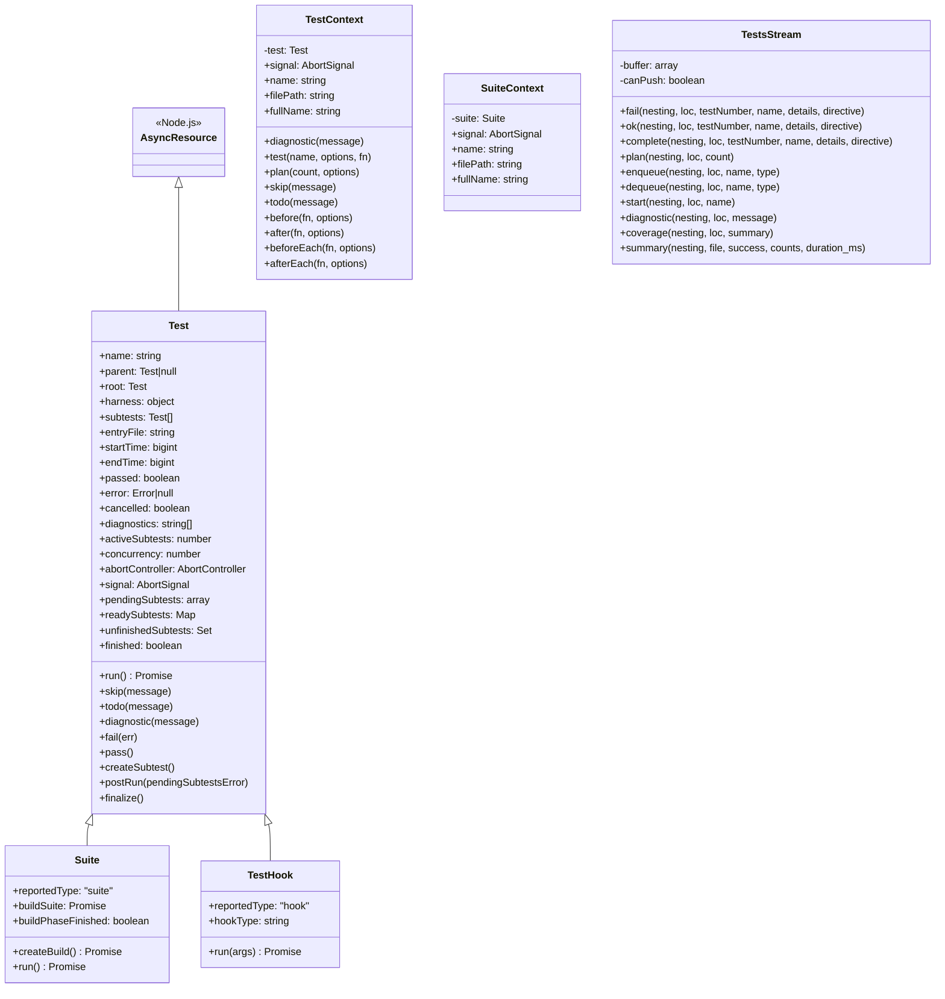
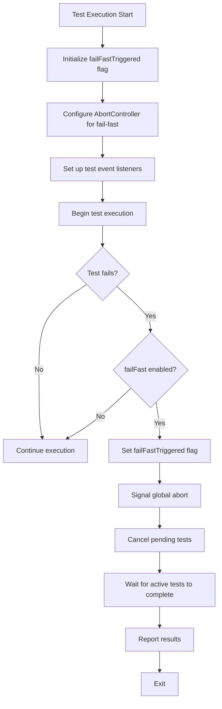
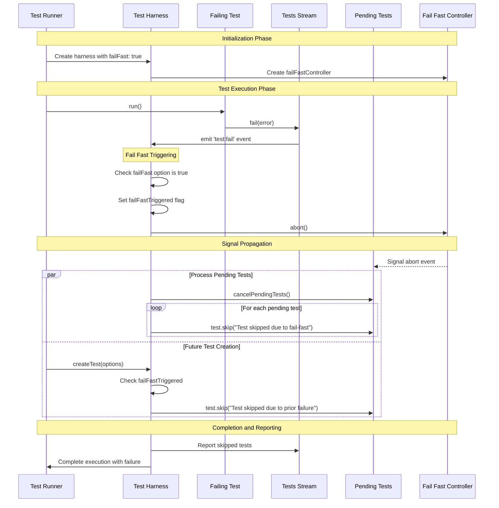
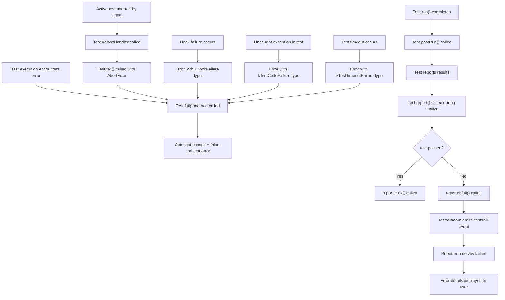
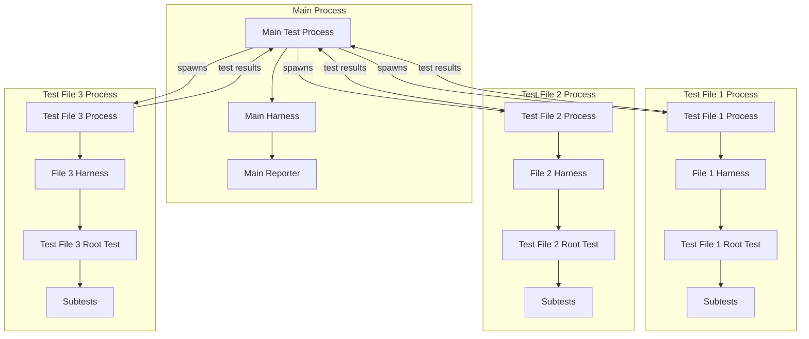
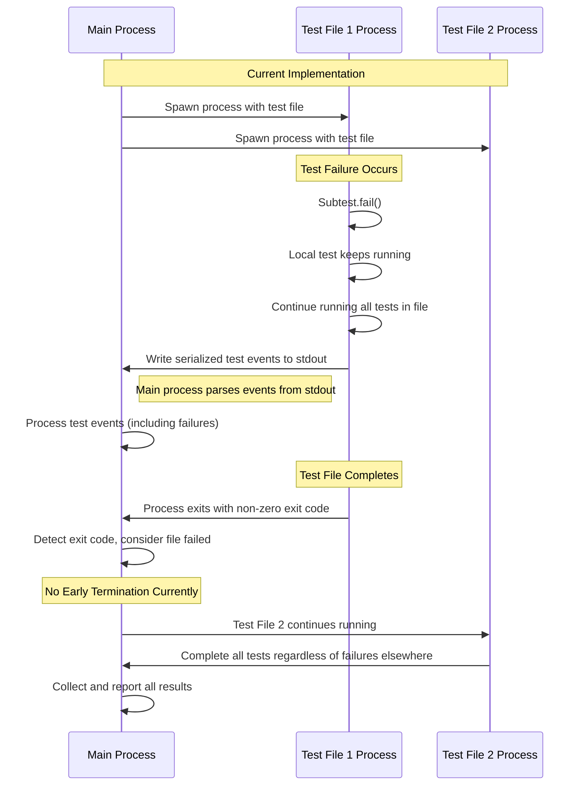
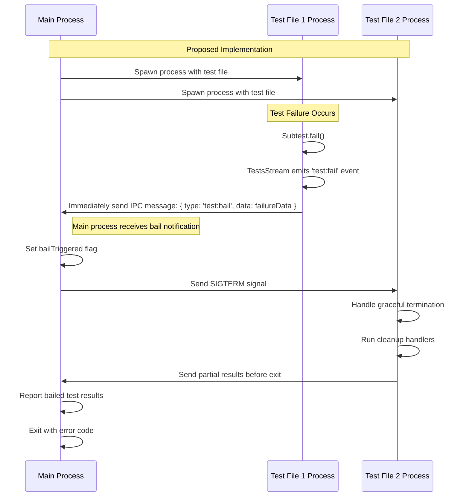

# Node.js Test Runner Flow Diagrams

## 1. Test Runner `run` Entry Point Flow

This diagram shows the execution flow when running the test runner through the `run` function, typically triggered by the `--test` command line flag or by programmatically calling `run()`.



## 2. Execution of a Test File without `run` Function (Lazy Bootstrap)

This diagram illustrates what happens when a test file is executed directly (e.g., `node test.js`) without using the `run` function or `--test` flag.



## 3. Event Sequence in TestsStream

This diagram shows the sequence of events emitted by the TestsStream during test execution, illustrating how test progress is communicated to reporters.



## 4. Test Tree Structure

This diagram shows the class structure of the test tree in the Node.js test runner.



## 5. Fail Fast Implementation Proposal

A fail-fast mechanism would allow the test runner to stop executing tests as soon as one test fails, regardless of concurrency settings. Here's a proposal for implementing this feature in Node.js test runner:

### Proposal: Fail-Fast Implementation with Concurrency Support



### Implementation Documentation

#### Overview

The fail-fast implementation would introduce a new option to the test runner that, when enabled, stops all test execution as soon as any test fails. This requires careful handling of concurrent tests.

#### Configuration Options

```javascript
// Example configuration with fail-fast enabled
test.run({
  files: ['test/*.js'],
  concurrency: 4,  // Allow 4 tests to run concurrently
  failFast: true   // Stop all tests on first failure
});
```

#### Key Components

1. **Global Abort Controller**
   - A shared AbortController that can trigger abort signals for all pending and future tests
   - Connected to all tests via signal propagation

2. **Failure Detection**
   - Listen to the TestsStream for 'test:fail' events
   - When a failure is detected and fail-fast is enabled, trigger the abort controller

3. **Test Queue Management**
   - Maintain a list of queued but not yet started tests
   - When fail-fast triggers, clear this queue and prevent new tests from being added

4. **Active Test Handling**
   - Allow tests already in progress to complete naturally
   - Abort or skip all tests waiting to be executed

#### Code Implementation Strategy

1. Add a new `failFast` option to the test runner configuration
2. Create a centralized failure tracker in the harness object
3. Enhance the test run and scheduling logic:

```javascript
// Pseudo-code for fail-fast implementation
class TestHarness {
  constructor(options) {
    this.failFast = !!options.failFast;
    this.failFastTriggered = false;
    this.failFastController = new AbortController();
    // ...other initialization
  }
  
  onTestFailure(test) {
    // Regular failure handling
    // ...
    
    // Fail-fast handling
    if (this.failFast && !this.failFastTriggered) {
      this.failFastTriggered = true;
      this.failFastController.abort();
      this.cancelPendingTests();
      this.reportFailFast(test);
    }
  }
  
  cancelPendingTests() {
    for (const test of this.pendingSubtests) {
      test.skip(`Test skipped due to fail-fast after failure in ${this.failFastTriggeringTest.name}`);
    }
    this.pendingSubtests = [];
  }
  
  createTest(options) {
    const test = new Test({
      ...options,
      // Combine the fail-fast signal with the test's own signal
      signal: options.signal ? 
        AbortSignal.any([options.signal, this.failFastController.signal]) :
        this.failFastController.signal
    });
    
    if (this.failFastTriggered) {
      test.skip('Test skipped due to prior failure with fail-fast enabled');
      return test;
    }
    
    // Normal test creation continues
    return test;
  }
}
```

#### Challenges and Considerations

1. **Race Conditions**: With concurrent tests, multiple failures might be detected simultaneously
   - Solution: Use atomic operations to ensure only the first failure triggers fail-fast

2. **Cleanup**: Even when stopping test execution, ensure proper resource cleanup
   - Solution: Run cleanup hooks for skipped tests and ensure teardown occurs

3. **Reporting**: Clearly indicate that tests were skipped due to fail-fast
   - Solution: Add a specific skip reason for tests not executed due to fail-fast

4. **Performance**: Maintain the performance benefits of concurrent execution until a failure occurs
   - Solution: Use efficient signaling mechanisms rather than polling

This implementation balances the immediate response needed for fail-fast with the complexities of concurrent test execution in Node.js.

## 6. Fail Fast Controller and Skip Mechanism Integration

This section explains how the proposed failFastController would interact with the existing test.skip mechanism to effectively stop test execution on the first failure while maintaining the test tree's integrity.



### How Skip Mechanism Works with Fail Fast

The integration between the failFastController and test.skip works through several key components:

1. **Signal-Based Communication**:
   - When a test fails and fail-fast is enabled, the failFastController's abort() method is called
   - This signals to all connected tests that execution should stop
   - Tests that are already running but listening to this signal can terminate early

2. **Skip Status Application**:
   - Tests use the skip() method to mark themselves as skipped without counting as failures
   - The skip method accepts a message explaining why the test was skipped
   - In fail-fast mode, tests are skipped with a clear message indicating they were skipped due to a prior test failure

3. **Test State Management**:
   ```javascript
   // Simplified implementation of how a test responds to fail-fast signals
   class Test {
     constructor(options) {
       // ...existing initialization
       
       // Connect to the fail-fast controller if available
       if (options.failFastSignal) {
         options.failFastSignal.addEventListener('abort', () => {
           if (!this.startTime) {
             // Test hasn't started yet - skip it entirely
             this.skip(`Skipped due to fail-fast after failure in ${options.failingTestName}`);
           } else if (!this.endTime) {
             // Test is in progress - attempt to abort it
             this.abortController.abort();
           }
         });
       }
     }
     
     // ...existing methods
   }
   ```

4. **Different Handling Based on Test State**:

   The system handles tests differently based on their current state when fail-fast is triggered:

   | Test State | Action Taken | Implementation Mechanism |
   |------------|-------------|--------------------------|
   | Not yet queued | Never created | TestHarness checks failFastTriggered before creating |
   | Queued, not started | Skipped | Removed from pendingSubtests queue, marked as skipped |
   | Currently running | Aborted | Test's own AbortController is triggered |
   | Completed | No action | Test has already reported its result |

5. **Preserving Test Tree Structure**:
   - Even when tests are skipped due to fail-fast, they remain in the test tree
   - This ensures that the test hierarchy is preserved for accurate reporting
   - The skipped tests are reported with a special directive indicating they were skipped due to fail-fast

6. **Handling Edge Cases**:
   - If a test is in the middle of setup when fail-fast is triggered, teardown functions still run
   - If multiple tests fail simultaneously in concurrent mode, only the first triggers fail-fast
   - Tests that are marked to "only" run still respect the fail-fast signal

This integration ensures that the test runner can quickly abort on first failure while still maintaining proper test structure, cleanup, and reporting.

## 7. Test Failure Communication Flow

This section clarifies how test failures are communicated throughout the test runner system, which doesn't only happen in the postRun of the root test.



### Test Failure Communication Details

The test:fail events are communicated at different points in the test lifecycle:

1. **Immediate Failure Recording**:
   - When `test.fail(err)` is called, it sets `test.passed = false` and stores the error
   - This happens as soon as a failure is detected, not just in postRun
   - Sources of failure include: assertion failures, exceptions, timeouts, hook failures

2. **Failure Reporting**:
   - The actual emission of the test:fail event happens during the reporting phase
   - In the Test.report() method, it checks if the test passed:
   ```javascript
   if (this.passed) {
     this.reporter.ok(this.nesting, this.loc, this.testNumber, this.name, report.details, report.directive);
   } else {
     this.reporter.fail(this.nesting, this.loc, this.testNumber, this.name, report.details, report.directive);
   }
   ```

3. **TestsStream Processing**:
   - The TestsStream.fail() method is what actually emits the 'test:fail' event:
   ```javascript
   fail(nesting, loc, testNumber, name, details, directive) {
     this[kEmitMessage]('test:fail', {
       __proto__: null,
       name,
       nesting,
       testNumber,
       details,
       ...loc,
       ...directive,
     });
   }
   ```
   - The kEmitMessage method both emits the event and pushes it to the stream

4. **Parent Test Notification**:
   - After a subtest finalizes, the parent test is notified through:
   ```javascript
   this.parent.addReadySubtest(this);
   ```
   - This propagates up the test tree, allowing parent tests to fail if subtests fail

5. **Asynchronous Failure Detection**:
   - Process-level handlers for 'uncaughtException' and 'unhandledRejection' can also trigger test failures
   - These are mapped to the appropriate test via the asyncId tracking system

This multi-layered approach ensures that failures are properly recorded, propagated, and reported throughout the test execution lifecycle.

## 8. Bail/Fail-Fast Implementation Flow with Concurrent Test Files

This section details the exact function calls and flow when a bail option is triggered by a subtest failure while test files are running concurrently.

### Test Process Isolation Architecture



### Current Implementation Analysis

After analyzing `runner.js`, I found that:

1. The child processes don't immediately send failure messages via IPC to the main process
2. Test results are currently communicated through:
   - TestsStream serializes test events into the child's stdout
   - The parent process (FileTest class) parses these messages from stdout
   - The failure message is only processed at the end of the complete test file



### Proposed Bail Implementation with IPC

To implement bail-out correctly, we need to add direct IPC communication:



### Implementation Strategy for Bail with IPC

Based on the analysis of `runner.js`, these changes would be needed:

1. **Child Process Modifications**:
   ```javascript
   // In the child process
   
   // Listen for test:fail events
   const onTestFail = (data) => {
     if (process.send && options.bail) {
       // Send immediate notification to parent via IPC
       process.send({ 
         type: 'test:bail', 
         testName: data.name,
         file: data.file,
         details: data.details 
       });
     }
   };
   
   reporter.on('test:fail', onTestFail);
   ```

2. **Parent Process Modifications in runner.js**:
   ```javascript
   // In FileTest class or runTestFile function
   
   // Set up IPC message handling
   if (options.bail) {
     child.on('message', (message) => {
       if (message.type === 'test:bail') {
         // Report the failure
         subtest.addToReport({
           type: 'test:diagnostic',
           data: { 
             file: path, 
             message: `Bail out! Test failed in ${message.file}: ${message.testName}` 
           }
         });
         
         // Kill all other running processes
         for (const [otherPath, otherProcess] of runningProcesses) {
           if (otherPath !== path && otherProcess.connected) {
             otherProcess.kill('SIGTERM');
           }
         }
       }
     });
   }
   ```

3. **Main Runner Modifications**:
   ```javascript
   // Add bail option to runTestFile options
   function runTestFile(path, filesWatcher, opts) {
     // ...existing setup code...
     
     const env = { 
       __proto__: null, 
       ...process.env, 
       NODE_TEST_CONTEXT: 'child-v8',
       NODE_TEST_BAIL: opts.bail ? '1' : undefined 
     };
     
     // ...existing code...
   }
   ```

### Implementation Integration Points for Process Isolation

To implement bail/fail-fast functionality correctly with process isolation, these are the key integration points:

1. **Main Process (Runner)**:
   - Add `bail` option to the command-line arguments and runner configuration
   - Pass bail configuration to each child process via environment variables
   - Set up explicit IPC communication to receive immediate test failures
   - Implement a bailout handler that terminates other processes
   - Track which processes are still running
   - Collect and aggregate results from processes that were terminated early

2. **Child Process (Test File)**:
   - Add listeners for test:fail events on the TestsStream
   - Send immediate IPC notifications when failures occur and bail is enabled
   - Handle termination signals gracefully
   - Ensure results are reported before exit even during early termination

3. **Process Communication**:
   - Define clear message protocol for bail notifications
   - Use process.send() for immediate failure communication
   - Continue using stdout for complete test results

This implementation would allow the test runner to immediately stop other test processes as soon as a test fails in one process, without waiting for the entire test file to complete.
